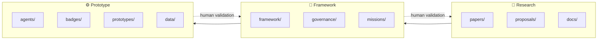

# 🌐 OpenLab Agentic Education

**Preserving human agency in AI-supported learning.**

[](LICENSE)
[](https://github.com/porroto/Agentic-Education/actions/workflows/markdown-check.yml)
[](data/README.md)
[](ROADMAP.md)

**AI assists. Humans govern. Evidence speaks. Communities validate.**

*Not robot-first. Trust-first.*

## What is this?

**OpenLab Agentic Education** is a research and prototype framework exploring how students, teachers, families, communities, institutions, and AI agents can **co-create learning evidence** — without surrendering human judgment to automation.

It is the public home of the OpenLab / S.A.T. Labs research line on:

- 📜 **Proof-of-learning** — verifiable evidence of real learning, owned by the learner
- 🤝 **Human-governed AI agents** — AI that assists review; humans validate meaning
- 🎖 **Learner-owned credentials** — portable, community-validated recognition
- 🛡 **Trust-first governance** — ethics, consent, and accountability by design

> **Anchor paper:** [*From Co-Intelligence to Proof-of-Learning*](papers/from-co-intelligence-to-proof-of-learning.md) — the conceptual foundation for everything in this repo.

## How the repo is organized

The project moves through three connected layers, with a human-governance loop running through all of them:



| Layer | What lives here | Folders |
|---|---|---|
| 🔬 **Research** | Concept papers, proposals, references | `papers/` · `proposals/` · `docs/` |
| 🧭 **Framework** | Rubrics, learning loops, governance, ethics | `framework/` · `governance/` · `missions/` |
| ⚙️ **Prototype** | Agent specs, badge schemas, synthetic evidence review | `agents/` · `badges/` · `prototypes/` · `data/` |

`gh600/` bridges an external agentic-AI certification track to the OpenLab framework — see [`gh600/certification-to-openlab-map.md`](gh600/certification-to-openlab-map.md).

Start here:

1. [`VISION.md`](VISION.md) — why this exists
2. [`MANIFESTO.md`](MANIFESTO.md) — the principles we won't compromise
3. [`ROADMAP.md`](ROADMAP.md) — where this is going
4. [`papers/`](papers/) — the concept paper and research grounding

## Quick start (researchers & educators)

```bash
git clone https://github.com/porroto/Agentic-Education.git
cd Agentic-Education
```

- **Educators** → start with [`framework/`](framework/) for rubrics and learning-loop designs
- **Researchers** → start with [`papers/`](papers/) and [`proposals/`](proposals/)
- **Builders** → start with [`agents/`](agents/) and [`prototypes/`](prototypes/) (synthetic data only)

## Safety & Ethics Boundary

This project follows a strict trust-first boundary:

- ✅ **Synthetic and de-identified examples only** — no real student data lives in this repo
- ✅ **Human validation is final** — AI suggests; teachers and communities decide
- ✅ **Classroom pilots require** school policy compliance, parent/guardian consent, and ethics review
- ✅ **Recognition, not speculation** — tokens and badges represent learning evidence, never financial instruments in school contexts

## Who is this for?

- **Teachers** designing evidence-based, project-driven classrooms
- **Researchers** studying human-AI co-intelligence in K–12 education
- **EdTech builders** who believe student agency is non-negotiable
- **Communities & families** who want a seat at the validation table

## Roadmap (high level)

- [x] Concept paper: *From Co-Intelligence to Proof-of-Learning*
- [x] Three-layer architecture (Research → Framework → Prototype)
- [ ] Evidence Review Agent v0 (synthetic artifacts, rubric alignment, audit trail)
- [ ] Badge schema v1 + mock digital wallet workflow
- [ ] Classroom-safe pilot kit (consent templates, teacher guide, rubrics)
- [ ] Community validation protocol
- [ ] Public research brief + call for collaborators

See [ROADMAP.md](ROADMAP.md) for details.

## Contributing

Contributions, critiques, and classroom perspectives are welcome — especially from educators and researchers. Please read [CONTRIBUTING.md](CONTRIBUTING.md) and our [Code of Conduct](CODE_OF_CONDUCT.md) first.

## Citing this work

If you use this framework in research, please cite it via [CITATION.cff](CITATION.cff).

## License

MIT — see [LICENSE](LICENSE).

---

**Built by [Roger Vargas](https://github.com/porroto)** · STEM educator & founder, S.A.T. Labs / OpenLab
*A teacher's heart with a global mind.* 🌎
