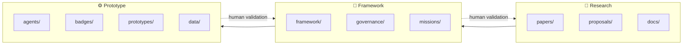

# 🌐 OpenLab Agentic Education

**Preserving human agency in AI-supported learning.**

[](LICENSE)
[](https://github.com/porroto/Agentic-Education/actions/workflows/markdown-check.yml)
[](data/README.md)
[](ROADMAP.md)

> **AI assists. Humans govern. Evidence speaks. Communities validate.**

*Not robot-first. Trust-first.*

## What is this?

**OpenLab Agentic Education** is a research and prototype framework exploring how learners, educators, families, communities, institutions, and AI agents can co-create and examine learning evidence **without surrendering human judgment or learner agency to automation**.

It is the public home of the OpenLab / **S.A.T. — Skills, Agency & Trust** research line on:

- 📜 **Proof-of-Learning** — inspectable evidence of learning centered on the learner
- 🤝 **Human-governed AI** — AI may assist Evidence Review; Human Validation remains final
- 🧭 **Learner agency** — learners can explain, question, challenge, and help govern their evidence record
- 🎖 **Recognition** — badges or credentials follow validated evidence; they are not the evidence itself
- 🛡 **Trust-first governance** — privacy, provenance, consent, accessibility, uncertainty, and accountability by design
- ✨ **MIRA** — *Meaningful Intelligence for Reflection and Agency*, a proposed learner-facing companion that helps learners reflect and act without becoming their evaluator

> **Anchor paper:** [*From Co-Intelligence to Proof-of-Learning*](papers/from-co-intelligence-to-proof-of-learning.md)

> **Vocabulary:** [`docs/TERMINOLOGY.md`](docs/TERMINOLOGY.md) defines the project's canonical language.

## The learning trust loop

```text
Mission → Learning Claim → Evidence → Reflection / Iteration
                         ↓
                AI-assisted Evidence Review
                         ↓
                HUMAN VALIDATION GATE
                         ↓
                    Learning Proof
                         ↓
          Recognition → Portfolio → Next Pathway
```

The goal is not to make learning more machine-readable. **The goal is to make learning more human-visible without surrendering human agency.**

## How the repo is organized

The project moves through three connected layers, with human governance running through all of them:



| Layer | What lives here | Folders |
|---|---|---|
| 🔬 **Research** | Concept papers, proposals, references | `papers/` · `proposals/` · `docs/` |
| 🧭 **Framework** | Rubrics, learning loops, governance, ethics | `framework/` · `governance/` · `missions/` |
| ⚙️ **Prototype** | Agent specs, recognition schemas, synthetic evidence review | `agents/` · `badges/` · `prototypes/` · `data/` |

`gh600/` bridges an external agentic-AI certification track to the OpenLab framework.

Start here:

1. [`VISION.md`](VISION.md) — why this exists
2. [`MANIFESTO.md`](MANIFESTO.md) — principles we will not compromise
3. [`docs/TERMINOLOGY.md`](docs/TERMINOLOGY.md) — the language of the system
4. [`framework/proof-of-learning-rubric.md`](framework/proof-of-learning-rubric.md) — PoLR v0.1
5. [`agents/mira.md`](agents/mira.md) — MIRA prototype specification
6. [`ROADMAP.md`](ROADMAP.md) — where this is going
7. [`papers/`](papers/) — research grounding

## Quick start

```bash
git clone https://github.com/porroto/Agentic-Education.git
cd Agentic-Education
```

- **Educators** → [`framework/`](framework/)
- **Researchers** → [`papers/`](papers/) and [`proposals/`](proposals/)
- **Builders** → [`agents/`](agents/) and [`prototypes/`](prototypes/) — synthetic data only

## Safety & Ethics Boundary

- ✅ **Synthetic and de-identified examples only** — no real student data belongs in this repo
- ✅ **Human Validation is final** — AI reviews, questions, organizes, and suggests; people validate
- ✅ **Minimum necessary evidence** — more learner data is not automatically better evidence
- ✅ **Classroom pilots require** applicable school policy compliance, consent/permission processes, and ethics review
- ✅ **Recognition, not speculation** — badges/credentials represent validated learning evidence and are not financial instruments
- ❌ **No financialized learning tokens for children**
- ❌ **No hidden behavioral, biometric, emotional, or psychological profiling**
- ❌ **No AI system gets to declare the human's learning complete**

## Who is this for?

- **Learners** who deserve agency over how their learning is represented
- **Teachers** designing evidence-based, project-driven classrooms
- **Researchers** studying human-AI collaboration and learning
- **Builders** who believe student agency is non-negotiable
- **Communities & families** who belong in the trust conversation

## Roadmap (high level)

- [x] Concept paper: *From Co-Intelligence to Proof-of-Learning*
- [x] Three-layer architecture (Research → Framework → Prototype)
- [x] Canonical terminology v0.1 — Skills, Agency & Trust; Learning Proof; Trust Envelope
- [x] MIRA prototype specification
- [x] PoLR v0.1 review draft
- [ ] Evidence Review Agent v0 synthetic adversarial test
- [ ] Trust Envelope schema v0.1
- [ ] Classroom-safe pilot kit
- [ ] Community validation protocol
- [ ] Public research brief + call for critique/collaborators

See [`ROADMAP.md`](ROADMAP.md) for details.

## Contributing

Contributions, critiques, and classroom perspectives are welcome — especially perspectives that expose where the framework could reproduce grading, surveillance, inequity, or false certainty. Please read [`CONTRIBUTING.md`](CONTRIBUTING.md) and our [`CODE_OF_CONDUCT.md`](CODE_OF_CONDUCT.md).

## Citing this work

See [`CITATION.cff`](CITATION.cff).

## License

MIT — see [`LICENSE`](LICENSE).

---

**Built by [Roger Vargas](https://github.com/porroto)** · STEM educator & founder, S.A.T. Labs / OpenLab  
*Let's Learn. Lead. Make.* 🌎